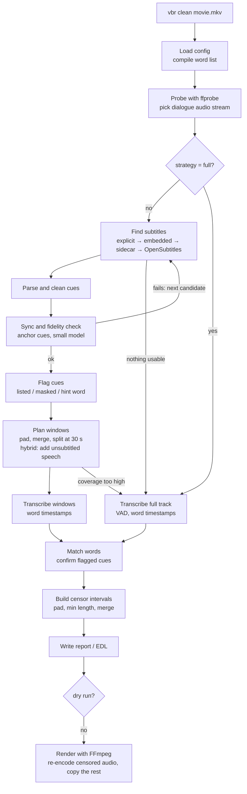

# video-beep-remover: design

**Status:** draft for review · **Last updated:** 2026-09-26 · **Example config:** [`vbr.example.toml`](vbr.example.toml)

## 1. Overview

`vbr` is a Python command-line tool that makes a "clean" copy of a video. Every word on a configurable list is muted in the soundtrack. The video stream and everything else in the file are copied untouched.

Whisper speech recognition (via [faster-whisper](https://github.com/SYSTRAN/faster-whisper)) finds each word and its timestamps. Running Whisper over a whole two-hour film is the slow part, so the tool first looks for subtitles: inside the file, next to it, or on OpenSubtitles.com. A subtitle cue that contains a listed word, or hints at one, shows where to listen. The tool then transcribes a few seconds of audio around each such cue to get exact word timings. For a typical film that is a few percent of the runtime instead of all of it. Without usable subtitles, it falls back to transcribing everything.

```
subtitles  →  cue 812 (01:13:02.0–01:13:05.0): "What the hell was that?"
audio      →  transcribe 01:13:00.5–01:13:06.5 only  →  "hell" at 01:13:03.41–01:13:03.78
ffmpeg     →  mute 01:13:03.29–01:13:03.90 · re-encode the audio track · copy video, subtitles, chapters
```

## 2. Goals and non-goals

**Goals**

1. Mute every occurrence of configured words and phrases in the dialogue track, with roughly 0.1 s precision and short fades so the cuts don't click.
2. Drive the word list and all behaviour from a TOML config file. The file supports categories, wildcards, phrases and an allowlist.
3. Use subtitles (embedded, sidecar or online) to limit speech recognition to candidate regions. Fall back to full transcription automatically.
4. Never re-encode video. Keep all other streams, chapters and metadata. Write output atomically.
5. Be auditable: provide a dry run, a JSON report, an EDL mute list, and rendering from a hand-edited report.
6. Run on Linux, macOS and Windows, on CPU only or with an NVIDIA GPU.

**Non-goals for v1**

- Beep tones or other sounds over censored words. Censoring is mute-only. Replacing a word with generated speech in the speaker's voice is a stretch goal (§16).
- Visual content (on-screen text, gestures) and cutting scenes.
- Filtering in real time during playback. The EDL export covers players that support mute lists.
- DRM-protected or encrypted media.
- Editing image-based subtitles (PGS, VobSub) or burned-in text.
- Non-English word lists out of the box. The design allows them (§15).

## 3. Command-line interface

The executable is `vbr`, also installed as `video-beep-remover`. It is built with Typer, with Rich for progress output.

### 3.1 Quick start

```console
$ pipx install video-beep-remover          # GPU users: pip install "video-beep-remover[gpu]"
$ vbr config init                          # writes a commented config to the per-user config dir
$ export OPENSUBTITLES_API_KEY=...         # optional: your own free key; enables online subtitle search
$ vbr clean "The Movie (2019).mkv"
  → The Movie (2019).clean.mkv
  → The Movie (2019).clean.vbr.json
```

### 3.2 Commands

| Command | Purpose |
|---|---|
| `vbr clean INPUT...` | Detect and censor. Writes the cleaned file(s) and a report. Inputs can be files or folders (`--recursive`). |
| `vbr scan INPUT...` | Detection only, the same as `clean --dry-run`. Writes the report and optional EDL, but no video. |
| `vbr render INPUT --report FILE` | Render from a report, which may be hand-edited. Skips detection. A report made for a different file (size, hash or duration) is refused without `--force`. |
| `vbr subs INPUT` | Show subtitle candidates, their scores and the sync check. `--save PATH` writes the chosen subtitles, converted to the format PATH names. Exits with 1 if no candidate is usable. |
| `vbr config init \| show \| check` | Write a starter config, print the effective merged config (secrets redacted), or validate it. |
| `vbr doctor` | Check the FFmpeg version and encoders, CUDA, the model cache and the API credentials. |
| `vbr cache info \| clear` | Inspect or clear the cache: downloaded subtitles and transcripts (§8.3). `clear --subtitles` or `--transcripts` clears one of them. |

### 3.3 Main options for `clean` and `scan`

| Option | Config key it overrides | Notes |
|---|---|---|
| `-c, --config PATH` | n/a | See §4.1 for discovery. |
| `-o, --output PATH` | `output.path` | A file (single input) or a directory. |
| `--strategy hybrid\|targeted\|full` | `analysis.strategy` | See §7. |
| `--no-fallback` | `analysis.fallback_to_full = false` | Fail instead of transcribing everything. |
| `--subtitles PATH` | n/a | Use this file and skip the search. It is treated as trusted. |
| `--offline` | `offline = true` | No network access at all: every network-backed subtitle provider is skipped and models load only from the local cache (§10). |
| `--categories strong,mild` | `lexicon.categories.*.enabled` | Enables exactly these categories. |
| `--model NAME`, `--device cpu\|cuda` | `transcription.model`, `.device` | |
| `--language CODE`, `--audio-stream N` | `analysis.language`, `.audio_stream` | |
| `--dry-run` | n/a | The same as `vbr scan`. |
| `--report PATH`, `--edl`, `--review-srt` | `output.report`, `output.edl`, `output.review_srt` | |
| `--overwrite`, `--skip-existing` | `output.overwrite` | `--skip-existing` is meant for batch runs. |
| `--keep-temp`, `-v`, `-q` | n/a | Debugging and verbosity. |

**Exit codes**

- `0`: success, including "nothing to censor".
- `1`: processing error.
- `2`: usage or config error.
- `3`: missing dependency (FFmpeg, a model or an encoder).
- `4`: batch finished with some failures.

### 3.4 Example session

The numbers below illustrate the output format. They are not measurements.

```console
$ vbr clean "The Movie (2019).mkv"
Probe       2:04:02 · video h264 (copy) · audio #1 eac3 5.1 eng [default], #2 aac 2.0 eng "Commentary" · subs #3, #4 subrip eng
Subtitles   embedded #4 "English SDH" (trusted) · 1,412 cues
Sync        6/6 anchors · offset +0.04 s · error 0.09 s · fidelity 0.91
Plan        43 flagged cues (38 word, 3 masked, 2 hint) + 9 unsubtitled speech regions → 36 windows · 4m41s of audio (3.8 %)
Transcribe  ━━━━━━━━━━━━━━━━━━━━ 36/36 windows · 0:52
Detect      47 detections (45 confirmed, 2 estimated) → 44 muted intervals
Render      ━━━━━━━━━━━━━━━━━━━━ 100 % · 1:12 · #1 censored → eac3 640k · #2 dropped (commentary) · subtitles censored
Done        The Movie (2019).clean.mkv · The Movie (2019).clean.vbr.json
```

## 4. Configuration

### 4.1 Format, discovery and precedence

The config is TOML, parsed with the standard library's `tomllib` (Python 3.11+). TOML was chosen over YAML for two reasons. It needs no extra dependency. It also has no implicit typing: in YAML 1.1 (PyYAML), unquoted `no`, `off`, `on` and `yes` become booleans, which is a real hazard in a *word list*.

The tool uses the first config file it finds:

1. `--config PATH`
2. `$VBR_CONFIG`
3. `./vbr.toml`
4. The per-user config dir via `platformdirs`: `~/.config/video-beep-remover/config.toml` on Linux, `~/Library/Application Support/video-beep-remover/config.toml` on macOS, `%APPDATA%\video-beep-remover\config.toml` on Windows.

That file is deep-merged over the packaged defaults (`defaults.toml`, which is the same file as `docs/vbr.example.toml`). There is one exception: if the file defines any `[lexicon.categories.*]`, those categories replace the packaged ones instead of merging with them, so the word list is exactly what the user wrote. Command-line flags are applied last. In any string value, `${NAME}` expands from the environment, and unset variables expand to an empty string. This keeps API keys and passwords out of the file.

### 4.2 Sections

| Section | Controls |
|---|---|
| top level: `offline` | No network access at all (§10) |
| `[lexicon]`, `[lexicon.categories.<name>]`, `[lexicon.hints]` | What to censor: terms, allowlist, masked-word detection, per-category `enabled`, subtitle hint words |
| `[censor]` | How muting is applied: padding, minimum length, merging, fade length |
| `[analysis]`, `.targeted`, `.sync` | Strategy and fallback, audio stream, spoken language, window planning, sync and fidelity thresholds |
| `[transcription]` | ASR backend, model, device, precision, batching, VAD, prompt |
| `[subtitles]`, `.opensubtitles` | Source order, languages, preference for hearing-impaired tracks, credentials |
| `[output]` | Output path, overwrite, codecs, other audio and subtitle streams, report and EDL |
| `[cache]`, `[tools]` | Cache location and size, FFmpeg and ffprobe paths |

A minimal config needs only the word list:

```toml
config_version = 1

[lexicon.categories.strong]
terms = ["*fuck*", "*shit*", "bitch*", "son of a bitch"]

[lexicon.categories.religious]
terms = ["goddamn*", "oh my [god]"]
```

### 4.3 Word-list syntax and matching rules

| Syntax | Example | Matches |
|---|---|---|
| word | `damn` | "damn", "Damn!" (whole word, any case) |
| prefix wildcard | `bitch*` | bitch, bitches, bitchy |
| infix/suffix wildcard | `*shit*` | shit, bullshit, shitty, dipshit |
| phrase | `son of a bitch` | consecutive words; each word may use wildcards |
| phrase with target | `oh my [god]` | censors only "god", and only after "oh my" |
| regex | `re:^f+u+c+k+` | escape hatch, applied to one normalized word |
| masked (built in) | `detect_masked = true` | "f\*\*\*", "sh\*t", "\*\*\*" (`masked_patterns`, default `[*#]`) |

Terms can also live in plain-text files (`lexicon.files`), with one term per line and `#` for comments. This makes lists easy to share.

The matcher runs on subtitle tokens and on Whisper words. The rules are:

1. **Normalization.** Apply NFKC, casefold, and straighten curly quotes. Strip surrounding punctuation but keep inner apostrophes and asterisks. Collapse runs of three or more identical letters, so "fuuuck" becomes "fuck" and "shiiit" becomes "shit".
2. **Whole words.** `*` matches zero or more letters, digits or apostrophes inside one word. It never spans a space.
3. **Hyphenated forms.** Both the hyphenated and the joined form are tested, e.g. "mother-fucker" and "motherfucker".
4. **Phrases.** A phrase matches consecutive words, ignoring punctuation between them.
5. **Allowlist.** Allowlist entries (same syntax) veto single-word matches. Use them to fix wildcard collisions, e.g. `bastard*` matching "bastardize".
6. **Masked tokens.** Masked tokens are flagged. Their category is inferred by aligning the visible letters with the terms (`f***ing` ↔ `*fuck*`). If nothing aligns, they get a built-in `masked` category.
7. **Overlaps.** Where terms overlap, the longest match wins. Each word is censored at most once.

Prefer prefix wildcards (`cunt*`) over infix ones (`*cunt*` would match "Scunthorpe"). `vbr config check` warns about wildcard terms with fewer than three literal letters.

**Hint words** (`[lexicon.hints]`, e.g. "freaking", "heck") are words subtitles often use *instead of* profanity. A cue containing one is checked against the audio. The hint word itself is never censored.

### 4.4 Validation

The config schema uses pydantic v2 models with `extra="forbid"`. A misspelled key is therefore an error, and the error message shows its TOML path. Regex terms are compiled when the config loads. `vbr config check` warns about:

- overly broad wildcards
- unknown categories named in `--categories`
- missing word files
- literal secrets in a config file that other users can read

## 5. Architecture

### 5.1 Pipeline



### 5.2 Package layout

```
src/video_beep_remover/
├── cli.py                 # Typer app → RunOptions
├── batch.py               # folders: skipping vbr's outputs, rendering in the background
├── pipeline.py            # per-file stages, strategy fallbacks, report, timings; vbr render
├── guided.py              # subtitle-guided analysis: targeted and hybrid (§6.3-6.9)
├── models.py              # dataclasses shared by all stages (§5.3)
├── languages.py           # language codes in configs, container tags and file names
├── ui.py                  # progress reporting interface
├── config/
│   ├── schema.py          # pydantic models
│   ├── loader.py          # discovery, deep merge, ${ENV} expansion, CLI overrides
│   └── defaults.toml      # packaged defaults (= docs/vbr.example.toml)
├── media/
│   ├── ffmpeg.py          # subprocess runner, version/encoder detection, -progress parsing
│   ├── probe.py           # ffprobe JSON → MediaInfo, stream selection
│   ├── audio.py           # window and full-track decoding: SeekingAudioSource, ArrayAudioSource
│   ├── render.py          # command files, filtergraph, stream mapping, codec choice, verification
│   ├── dialogue.py        # do other audio streams carry the analysed dialogue? (cross-correlation)
│   └── selftest.py        # `vbr doctor`'s mute test on a synthetic tone
├── subtitles/
│   ├── acquire.py         # embedded and sidecar candidates, ranking, one-pass extraction
│   ├── parse.py           # encoding detection, pysubs2 parsing, cue cleaning
│   ├── sync.py            # anchors, tracked search, Theil–Sen fit, fidelity
│   ├── save.py            # `vbr subs --save`
│   ├── opensubtitles.py   # REST client: search, login, download, quota, retries
│   ├── online.py          # OpenSubtitles as a source: cache first, hash search, then title search
│   ├── oshash.py          # movie hash and fingerprint
│   ├── names.py           # guessit: title, year, episode and release from file names; .nfo IMDb ids
│   ├── cache.py           # downloaded subtitles, indexed by video fingerprint
│   ├── ffsubsync.py       # optional re-sync with ffsubsync
│   ├── censor.py          # masking listed words in SRT, WebVTT, ASS and other subtitle text
│   └── output.py          # the output's subtitle streams, and the censored copy of a sidecar
├── asr/
│   ├── base.py            # Transcriber protocol, Clip
│   ├── faster_whisper.py  # default backend (sequential, or batched with packed windows)
│   ├── vad.py             # Silero speech regions; trimming clips to their speech
│   ├── cache.py           # transcripts and speech regions kept between runs (§8.3)
│   └── later: whisperx.py (M5)
├── detect/
│   ├── normalize.py, lexicon.py, matcher.py
│   ├── planner.py         # flagging, windows, uncovered speech, coverage
│   ├── confirm.py         # window transcripts → detections, confirmation, estimates
│   └── intervals.py       # padding, min length, merge
└── report/                # JSON report, EDL, review SRT; reading a report back for vbr render
```

### 5.3 Core data types

All times are seconds on the media timeline (§6.2). The exception is `Cue`, which stays in subtitle time until the sync model (§6.6) maps it.

```python
@dataclass(frozen=True)
class Word:              # one recognized word
    text: str; start: float; end: float; probability: float

@dataclass(frozen=True)
class Cue:               # one cleaned subtitle cue, in subtitle time
    index: int; start: float; end: float; text: str; lyrics: bool

@dataclass(frozen=True)
class SyncModel:         # subtitle time → media time
    scale: float = 1.0; offset: float = 0.0; error: float = 0.0
    def to_media(self, t: float) -> float: return self.scale * t + self.offset

@dataclass(frozen=True)
class Window:            # audio to transcribe
    start: float; end: float; reasons: frozenset[str]; cues: tuple[int, ...]

@dataclass(frozen=True)
class Detection:         # a listed word heard (or estimated) in the audio
    start: float; end: float; heard: str; term: str; category: str
    confidence: float; source: Literal["asr", "estimate", "cue"]; cue: int | None

@dataclass(frozen=True)
class CensorInterval:    # a span the renderer mutes; always disjoint
    start: float; end: float
```

### 5.4 Extension points

Each stage depends on a small `Protocol`, so backends can be swapped and tests can inject fakes.

```python
class SubtitleProvider(Protocol):
    name: str
    network: bool                     # True for online providers; all of them are skipped when offline
    def find(self, media: MediaInfo, languages: Sequence[str]) -> list[SubtitleCandidate]: ...
    def fetch(self, candidate: SubtitleCandidate) -> SubtitleDocument: ...

class AudioSource(Protocol):          # float32 mono 16 kHz; sample 0 == `start` on the media timeline
    def read(self, start: float, end: float) -> np.ndarray: ...

class Transcriber(Protocol):          # Clip = media start time + samples; words come back in media time
    def transcribe(self, clips: Sequence[Clip], *, language: str, prompt: str | None,
                   vad: bool = False, on_progress: Callable[[float], None] | None = None
                   ) -> list[list[Word]]: ...

class Renderer(Protocol):
    def render(self, plan: RenderPlan, progress: Callable[[float], None]) -> Path: ...
```

## 6. Pipeline stages

### 6.1 Probe and stream selection

The probe runs `ffprobe -v error -show_format -show_streams -show_chapters -of json file:<input>` and records:

- duration and the container `start_time`
- for each stream: codec, channels, `channel_layout`, `sample_rate` and `bit_rate`
- `tags.language` and `tags.title`
- dispositions: `default`, `forced`, `hearing_impaired`, `comment`, `visual_impaired`

With `audio_stream = "auto"`, the dialogue stream is chosen like this:

1. Exclude commentary (`comment` disposition, or a title matching /commentary/i) and audio description (`visual_impaired`, /description/i).
2. Prefer the configured language, then the `default` disposition, then the most channels, then the lowest index.

Encrypted streams are rejected with a clear error.

### 6.2 One timeline for everything

Windows, words, intervals and synced cue times are all seconds on the **media timeline**. On this timeline 0 is the container's start. This matches what FFmpeg does by default (without `-copyts`), both for the `-ss` input option and for the `t` seen by filters. Appendix A verifies this with an MPEG-TS file whose timestamps start at 31.4 s. Three rules follow:

- **Window extraction** decodes only what is needed and pins sample 0 to the requested time, even when the audio track starts late:
  ```
  ffmpeg -nostdin -ss S -t D -i file:<input> -map 0:<audio index> \
         -af aresample=async=1:first_pts=0 -ac 1 -ar 16000 -f f32le pipe:1
  ```
- **Full-track extraction** uses the same `aresample=async=1:first_pts=0`. Without it, sample 0 is the first decoded audio sample. In the prototype, an MKV whose audio started 0.479 s after the video decoded with that 0.479 s shift, which would have moved every detection (Appendix A).
- **Rendering** never uses `-copyts`. Subtitle cue times are assumed to be on the same timeline. The sync check (§6.6) absorbs any constant offset left over.

### 6.3 Finding subtitles

Sources are tried in the configured order. Acquisition stops at the first candidate that passes the sync check (§6.6). A source is searched only when the ones before it produced nothing usable, so the network is used only when local subtitles fail. Within a source, candidates are ranked. With `offline = true`, every provider that declares `network = True` makes no request, whatever its own `enabled` setting. That covers OpenSubtitles and every provider behind the subliminal adapter. Subtitles OpenSubtitles downloaded earlier are still offered from the cache, since using them needs no network.

| Source | How | Trust |
|---|---|---|
| `--subtitles PATH` | As given. | trusted |
| embedded | Text subtitle streams (`subrip`, `ass`, `ssa`, `webvtt`, `mov_text`, `text`). Extraction reads the whole file, so every candidate stream is extracted in one pass (`ffmpeg -i file:<input> -map 0:<index> -f srt <file> ...`), the first time one is needed. ASS stays ASS. Commentary tracks are skipped. | trusted |
| sidecar | `<stem>.*.{srt,ass,ssa,vtt}` next to the video or inside `Subs/` or `Subtitles/`; `Subs/<stem>/*` (season packs); any file in `Subs/` when the video is alone in its folder (movie releases). Language, SDH and forced come from name tokens (`.en.`, `.eng.`, `.English.`, `.sdh.`, `.cc.`, `.forced.`). `.hi.` means hearing impaired next to a language token and Hindi on its own. | trusted |
| OpenSubtitles.com | Hash search first, then a metadata search (§6.4). | trusted if `moviehash_match`, otherwise untrusted |
| more providers (optional `subliminal` adapter) | Podnapisi, Addic7ed, Gestdown, and others. | untrusted |

**Ranking.** These filter candidates out:

- the wrong language
- forced or foreign-parts-only tracks
- machine- and AI-translated files (by default)

These add to a candidate's score:

- SDH or hearing-impaired (configurable), because these tracks tend to be closer to verbatim
- a hash match
- a similar release name, compared on guessit fields. Edition and release group weigh most, since a different cut or group usually means different timing; source and streaming service less; resolution and codec a little.
- a subtitle `fps` equal to the video's frame rate
- download count, used as a tie-breaker

Candidates with an unknown language are kept, after the ones known to match. At most `max_candidates` candidates are tried from each source; each OpenSubtitles one costs a download unless it is cached.

Image-based streams (PGS, VobSub, DVB) are ignored for analysis; OCR is out of scope.

### 6.4 OpenSubtitles.com provider

This provider uses the REST API v1 at `https://api.opensubtitles.com/api/v1/`. Every request sends `Api-Key`, a descriptive `User-Agent` (app name and version) and `Content-Type: application/json`. `Authorization: Bearer <token>` from `POST /login` is optional and raises the download quota.

1. **Hash.** The hash is read from 64 KiB at each end of the file, so it is cheap even for 50 GB files:
   ```python
   def opensubtitles_hash(path: Path) -> str:
       """File size + the first and last 64 KiB summed as little-endian uint64, mod 2**64."""
       chunk = 64 * 1024
       size = path.stat().st_size
       if size < 2 * chunk:
           raise ValueError("file too small for the OpenSubtitles hash")
       h = size
       with path.open("rb") as f:
           for offset in (0, size - chunk):
               f.seek(offset)
               for (value,) in struct.iter_unpack("<Q", f.read(chunk)):
                   h = (h + value) & 0xFFFF_FFFF_FFFF_FFFF
       return f"{h:016x}"
   ```
2. **Hash search.** `GET /subtitles?moviehash=<hash>&languages=en`. From each result it reads `attributes.moviehash_match`, `hearing_impaired`, `foreign_parts_only`, `machine_translated`, `fps`, `release`, `download_count` and `files[].file_id`. Hash-matched subtitles were timed against this exact file, so they are trusted.
3. **Metadata search** runs only when no result is hash-matched. `guessit(<filename>)` supplies the title, year, season and episode, and the search is `GET /subtitles?query=<title>&year=<year>&languages=en`. For episodes it adds `season_number` and `episode_number`. For a movie with an IMDb id in a Kodi-style `.nfo` file next to it, it searches by `imdb_id` instead. Parameters are sent sorted and in lower case, as the API asks, which avoids redirects. Results split over several CDs are skipped.
4. **Download.** `POST /download {"file_id": N}` returns `{link, remaining, reset_time_utc}`. The tool fetches `link`, caps the file at 5 MB and decodes it as in §6.5. The API key is sent only to the API, never to the host serving the file. The file is cached under its `file_id`, and an index records it under the video's fingerprint (hash and size). So a cached copy never costs quota again, and a later run offers it first, even offline or without a key.
5. **Quota and rate limits.** Downloads are limited per 24 h: 5 per IP address without logging in, more for logged-in and VIP users. The tool downloads only the top candidate and tries the next one only if the sync check fails, up to `max_candidates`. When the quota runs out (`remaining` reaches 0 or a download is refused), the tool warns, records the reset time in the report and moves on to the fallback. HTTP 429 is retried with capped exponential backoff, honouring `Retry-After`.

**API key.** No API key ships with the tool. Each user creates a free OpenSubtitles.com account, registers their own API consumer to get a key, and supplies it through `${OPENSUBTITLES_API_KEY}`. Without a key, no online search is made, with a notice. Subtitles downloaded earlier are still used from the cache, and the other subtitle sources are still tried. If none of them yields a usable candidate, the fallback rules in §7 apply: the run transcribes the whole soundtrack, or fails when `fallback_to_full = false`. `vbr doctor` reports whether a key is set and accepted. It checks with a search, which costs no quota, because the `/infos` endpoints answer any key. With a bad key, a search returns 403 "You cannot consume this service" and a download returns 503. The legacy OpenSubtitles.org XML-RPC API is not used.

### 6.5 Parsing and cleaning cues

Files are decoded from UTF-8 or a BOM first. Failing that, the usual code page for the subtitle's language is tried: cp1252 for Western European languages, cp1250 for Central European ones, cp1251 for Cyrillic. charset-normalizer's guess comes last, because a short text is ambiguous: French in cp1252 can pass for Baltic cp1257. pysubs2 parses SRT, ASS/SSA, WebVTT and MicroDVD. Frame-based MicroDVD needs the video frame rate, which comes from the probe. WebVTT `NOTE`, `STYLE` and `REGION` blocks are dropped first, since pysubs2 would read them as cue text. Cleaning then:

- removes markup (`<i>`, `{\an8}`, ASS override tags), speaker labels (`JOHN:`), SDH descriptions (`[door slams]`, `(laughs)`) and leading dialogue dashes
- keeps lines with ♪ but marks the cue `lyrics=True`
- joins multi-line cues
- sorts cues, and merges a line repeated in overlapping cues (e.g. the same line on two ASS layers)
- drops comments, drawings and empty cues

Estimates (§6.9) use word positions in the cleaned text. Output censoring (§6.11) does not use it: it finds words in the text a viewer sees, where markup takes no space, and masks them in the original.

### 6.6 Sync and fidelity check

This check maps subtitle time to media time, `t_media = scale · t_sub + offset`. It also measures how verbatim the subtitles are ("fidelity").

1. **Anchors.** Choose `anchors` cues (default 6) spread across the runtime. Each must have four or more words, last 1–7 s and not be lyrics. Cues with less common words are preferred.
2. **Search windows.** Search ±`trusted_search_s` (3 s) or ±`untrusted_search_s` (20 s) around each anchor's predicted position.
   - Anchors are processed in time order, and the prediction is refitted after every match. This tracking follows a drift that builds up slowly, such as NTSC's 0.1 % (7 s over two hours).
   - A frame-rate mismatch such as 25 vs 23.976 fps (4.3 %, about 2.5 minutes per hour) moves farther than the search between two anchors, so tracking alone loses it. If the candidate's `fps` differs from the video's frame rate by a standard ratio, that ratio is applied up front; otherwise ffsubsync has to find it.
3. **Transcription.** Transcribe the anchor windows with the small `anchor_model` (`base.en`, or the multilingual `base` for other languages), with word timestamps. Each window is first trimmed to its speech, as in §6.8, so the first word of a line after a pause is not placed too early. An anchor window holds several lines, though, and the pauses between them stay: the first word after one was often placed where the previous line ended, up to 2 s early (in the evaluation, Appendix C). So a word that starts in a pause, at least 0.3 s before speech resumes, and ends in the speech after it is moved to where speech resumes.
4. **Matching.** Find the cue text in the recognized words with rapidfuzz: slide a token window and require a ratio of at least 75 (rapidfuzz scores run from 0 to 100). Each match yields a pair (cue start, word start).
5. **Fit.** The scale is one that real mismatches produce: 1, 25/23.976, 25/24, 24/23.976, 30/29.97, or the inverse of any of them. With three or more pairs spanning at least 60 s, each of these is tried, and the one that leaves the smallest median absolute residual wins, unless it beats the default (1, or the ratio applied up front) by 50 ms or less. With fewer or closer pairs, only the offset is fitted. The offset is the median residual, and the error the median absolute residual. An earlier draft fitted a Theil–Sen slope and snapped it to a standard ratio within 0.1 %. With six rough anchors over a few minutes, that slope landed anywhere near 1, e.g. at 1.0026, which would put the end of a two-hour film 19 s out.
6. **Fidelity.** Take the median `token_sort_ratio` between each anchor's text and the words heard, divided by 100. Fidelity is therefore a 0–1 fraction, on the same scale as `min_fidelity` and the report.
7. **Decision.** The check passes if `matched ≥ min_matched_ratio`, `error ≤ max_error_s` and `fidelity ≥ min_fidelity`. `anchors = 0` skips the check and trusts the timing as it is. If it fails:
   - If the failure is about timing (anchors not heard where expected, or too large an error) and [ffsubsync](https://github.com/smacke/ffsubsync) is installed, run it. It uses speech-activity correlation, corrects frame-rate mismatches and handles offsets up to 60 s by default. Then check again with the trusted ±3 s search, since its output must be in sync. Subtitles that fail on fidelity are paraphrased, and ffsubsync cannot fix that. During implementation, subtitles 30 s late were re-timed in 0.6 s on a 44 s clip and then passed with a 0.08 s error.
   - Otherwise try the next candidate.
   - Otherwise use the fallback (§7).

**Cost.** Trusted subtitles need about 6 × 9 s ≈ 1 minute of audio through a small model. Untrusted subtitles need about 6 × 43 s ≈ 4.3 minutes.

### 6.7 Flagging cues and planning windows

Each cue gets zero or more **flag reasons**:

- `lexicon` (strong): the cue contains a listed term.
- `masked` (strong): the cue contains a masked token.
- `hint` (weak): the cue contains a hint word.

Windows are planned from the flagged cues:

1. **Window.** `[T(start) − p, T(end) + p]`, where `T` is the sync model and `p = window_padding_s + 3 × sync error`.
2. **Minimum length.** Extend each window to `min_window_s` (4 s), because Whisper does poorly on very short clips. Clamp to `[0, duration]`. A window entirely outside the media, e.g. for a cue after the end of a truncated file, is dropped.
3. **Merge and split.**
   - Merge windows less than `merge_gap_s` apart.
   - Split windows longer than `max_window_s` (30 s) into pieces that overlap by 2 s. faster-whisper's batched pipeline transcribes only the first 30 s of each clip.
4. **Hybrid mode.** Decode the full track once (16 kHz mono, cached) and run Silero VAD over it, in 10-minute chunks so memory stays flat. From the speech regions, subtract every cue's span ±0.5 s, not just flagged cues. Remaining speech of 0.5 s or more becomes a window with reason `uncovered`. These are typically songs, background voices and lines the subtitles skipped.
5. **Coverage guard.** If the windows add up to more than `max_coverage` (35 %) of the runtime, switch to full mode. At that point full mode is cheaper, because it has no duplicated context and batches better. With `fallback_to_full = false` the windows are transcribed anyway, since they still cost less than everything.

### 6.8 Transcription

The default backend is faster-whisper.

- **Model `auto`.**
  - GPU: `large-v3-turbo` in float16.
  - CPU: `large-v3-turbo` in int8 for targeted and hybrid windows, which are only minutes of audio, and `small.en` in int8 for full mode.
  - Anchors always use `base.en`.
  - The benchmark (§11) confirms or changes these defaults.
- **Decoding options.**
  - `language` is always fixed, because language detection is unreliable on short windows.
  - `word_timestamps=True`.
  - `condition_on_previous_text=False`, which limits hallucination loops.
  - `vad_filter=True` in full mode.
- **Batching.** On GPU, windows are packed into one buffer and sent to `BatchedInferencePipeline.transcribe(buffer, clip_timestamps=[{"start": s, "end": e}, ...], word_timestamps=True)`. The clip times are in seconds and relative to the buffer. Times map back with `t_media = window.start + (t_buffer − window.buffer_offset)`. On CPU, windows are transcribed one after another.
- **Profanity spelling.** Whisper sometimes writes profanity masked, e.g. "s\*\*\*" ([openai/whisper#1534](https://github.com/openai/whisper/discussions/1534)). The masked-token rule catches that. In addition, `initial_prompt = "auto"` primes the decoder with a short uncensored sentence built from enabled terms, which pushes it toward verbatim spelling. The benchmark must show this does not add false positives before the default ships (open question 1).
- **Trimming to speech.** After a pause, Whisper tends to start the first word at the very beginning of the clip. During implementation, a word 0.85 s into a clip was placed at 0.00 s, and faster-whisper's own clamp only engages after longer pauses. So each window is trimmed to its speech (Silero VAD, which pads speech by 0.2 s, plus 0.1 s) before transcription. That brought the error to about 0.2 s, spent in silence. A window where VAD hears nothing is transcribed whole, since VAD can miss shouting or singing.
- **Window edges.** Words within 0.3 s of a window edge are dropped as unreliable, because the edge may cut a word in half. The rule does not apply at the start or end of the file, or at an edge trimmed to silence. Where the pieces of a split window overlap, each keeps its words before or after the middle of the overlap. Windows are padded so flagged cues sit well inside them.
- **Model files.** Models are downloaded from Hugging Face on first use and cached. With `offline = true` they load with `local_files_only=True`. A model missing from the cache is then an error (exit code 3), not a download.
- **Optional alignment.** The `whisperx` backend adds wav2vec2 forced alignment for tighter word boundaries. Default alignment models cover English, French, German, Spanish and Italian.

### 6.9 Matching and confirmation

The matcher runs over each window's words and produces detections: heard text, term, category and probability.

**Confirmation.** A strong-flagged cue is **confirmed** when a detection overlaps `T(cue) ± p`. For an unconfirmed strong cue, the window is widened once by `expand_by_s` and transcribed again. If it is still unconfirmed, `on_unconfirmed` decides:

- `estimate` (default): estimate the word's time from its character position in the cue, since speech is roughly uniform within a cue. Censor that span ±0.3 s and give it low confidence. This handles subtitles that are right but that Whisper mishears.
- `cue`: censor the whole cue. This is heavy-handed.
- `skip`: censor nothing, and list the cue in the report.

**Other cases.**

- Unconfirmed weak (hint) flags are dropped, because the audio showed no listed word.
- Detections outside flagged cues are kept: the audio is the source of truth. A softened subtitle next to a flagged one is a common case.
- If ASR confirms fewer than half of the strong flags, and there are at least three, the subtitles evidently don't match this audio. The run escalates to full mode, if fallback is allowed.

### 6.10 Building censor intervals

Each detection `[start, end]` becomes an interval as follows:

1. Widen it by `pad_before_ms` and `pad_after_ms`, because Whisper's word timestamps are approximate.
2. Extend it symmetrically to `min_duration_ms`.
3. Clamp it to `[0, duration]`.
4. Sort the intervals and merge any that are less than `merge_gap_ms` apart.

The result is **sorted and disjoint by construction**, which the renderer requires (§6.11). The renderer's fades sit inside this padding, so they never touch the word itself.

An optional refinement moves each edge *outward only* to the nearest 10 ms RMS energy minimum within 80 ms. This avoids clipping half a syllable.

### 6.11 Rendering with FFmpeg

**Principles.**

- Video, subtitle, attachment and data streams are stream-copied.
- Only censored audio streams are re-encoded.
- Output goes to `<name>.partial<ext>` and is renamed on success. A failed run leaves nothing half-written.

For each censored stream, the renderer writes one **command file** into a job temp dir. The file drives a single `afade` filter. Around each interval it re-arms the filter twice: a fade-out that starts at the interval's start, then a fade-in that ends at the interval's end. Each fade lasts `fade_ms` (default 10 ms). For the example interval, with the previous interval ending at 4371.050 s:

```
4371.050-4383.290 [enter] afade@mute0 t out, [enter] afade@mute0 st 4383.290, [enter] afade@mute0 d 0.010;
4383.300-4383.890 [enter] afade@mute0 t in, [enter] afade@mute0 st 4383.890, [enter] afade@mute0 d 0.010;
```

Each line fires once, when the first audio frame that starts inside its time range arrives. The ranges are the stable stretches where the old and new settings give the same gain: full volume between intervals, silence inside one. So it doesn't matter which frame delivers a command.

The filtergraph for that stream was verified in the prototype (Appendix A):

```
[0:a:0]asetnsamples=n=480:p=0,asendcmd=f=mute0.cmd,afade@mute0=t=in:ss=0:ns=1:curve=qsin[out0]
```

**Why this graph.**

- **Sample-accurate edges without clicks.** `afade` computes its gain for every sample from the timestamps, so each edge is a 10 ms quarter-sine ramp placed exactly where requested. Switching the volume abruptly instead snaps edges to audio frames and clicks. In the prototype, with edges falling mid-cycle on a −18 dBFS test tone:
  - hard cut: click energy above 2 kHz peaked at −25 dBFS
  - `afade` ramps: −67 to −79 dBFS, close to the −90 dBFS floor

  Stepping the volume down in 5 ms stages made clicks worse, because each step is its own discontinuity.
- **Command file, not expressions.** The cost doesn't grow with the number of intervals: 479 muted spans added about 4 % to a 2-hour audio re-encode. An earlier variant built `enable='between(t,…)+…'` expressions instead, and they added 75 % at 500 intervals. Long expressions also hit command-line limits and need escaping.
- **Bounded frames.** A command fires only when a frame starts inside its time range. `asetnsamples=n=<rate/100>` caps frames at 10 ms, far shorter than any range: gaps and intervals are at least 250 ms, thanks to §6.10's merge gap and minimum length. Precision comes from `afade`, not from the frame size.
- **Sorted, disjoint intervals.** The fade sequence assumes intervals don't overlap, which §6.10 guarantees.
- **Initial state.** `t=in:ss=0:ns=1` starts at full volume. If the first interval starts at 0 s, its fade-out goes into these initial options instead of a command.
- **FFmpeg versions.** `afade` has accepted `t`, `st` and `d` as runtime commands since FFmpeg 5.0. The graph was run on 5.1.1 and 6.1.1 with identical results.
- **Paths.** The job temp dir is FFmpeg's working directory, so command files are referenced by relative name. That avoids escaping paths inside the filtergraph, such as Windows drive colons. Input and output are absolute paths with the `file:` prefix, which is safe for names that start with `-` or contain `:`.
- **Loading the graph.** Use `-/filter_complex graph.txt` on FFmpeg 7 and later, where `-filter_complex_script` is deprecated. Use `-filter_complex_script graph.txt` on 5.x and 6.x.

**Invocation (sketch).** Streams are mapped in their original order:

```
ffmpeg -hide_banner -nostdin -y -i file:/abs/in.mkv -filter_complex_script graph.txt \
  -map 0:v:0 -map "[out0]" -map 0:s? -map 0:t? \
  -c copy -c:a:0 eac3 -b:a:0 640k \
  -metadata:s:a:0 language=eng -metadata:s:a:0 title="English 5.1" -disposition:a:0 default \
  -map_metadata 0 -map_chapters 0 -max_muxing_queue_size 4096 \
  -progress pipe:1 -nostats file:/abs/out.partial.mkv
```

**Verifying the output.** FFmpeg ignores a filter command it rejects without any warning, and still exits with code 0. A generator bug or an unusual FFmpeg build could therefore produce an unmuted file silently. So after rendering, the tool decodes the core of every muted span from the output (the span minus its fades) using input seeking, which is cheap. Each core must be below −60 dBFS RMS. If any span fails, the output is deleted and the run exits with code 1. Re-encoding can move the output's timeline. An AAC encoder's priming packet sits before the first sample, and in Matroska it can make the new file start earlier than the old one: 21 ms at 48 kHz, 46 ms at 22.05 kHz. FFmpeg shifts every stream alike, so the check measures the shift on a stream-copied stream, usually the video, and looks that much later. The mutes themselves are unaffected, since the filter works on the input's timeline, and audio and video stay in sync. The report records the shift as `output.timeline_shift`. `vbr doctor` runs the same graph on a one-second synthetic tone, which catches an FFmpeg that can't run the graph before any real work starts.

Filtered streams lose their per-stream tags, so language, title and disposition are re-applied from the probe. MP4 and MOV outputs also get `-movflags +faststart`. Progress comes from `out_time_us` on the `-progress` pipe.

**Audio codec (`audio_codec = "auto"`)**

| Source | Re-encoded as |
|---|---|
| AAC, AC-3, E-AC-3 | the same codec at the source bitrate |
| MP3, Opus, Vorbis | `libmp3lame`, `libopus`, `libvorbis` if FFmpeg has them, otherwise AAC |
| FLAC, ALAC, PCM | the same codec (lossless) |
| DTS, DTS-HD, TrueHD, others | FLAC in MKV, AAC in MP4/MOV (FFmpeg has no production-quality encoders for these) |

Re-encoding a lossy track at its source bitrate costs a generation of quality, which is generally inaudible. With MKV, `audio_codec = "flac"` avoids that loss entirely. `vbr doctor` checks `ffmpeg -encoders` up front.

**Other audio streams (`other_audio_streams`)**

- `auto` (default): streams with the analyzed stream's language get the same intervals, which covers e.g. a stereo downmix next to the 5.1 mix. Other languages, commentary and audio description are dropped with a warning, since keeping them would leave uncensored speech in the file. A cheap guard checks that a same-language stream really carries the same dialogue before applying the intervals. It decodes both streams' 16 kHz mono downmixes around up to five muted spans spread over the file, each widened by 1 s, and takes the median of their normalized cross-correlation within ±0.1 s of lag. At 0.5 or more the stream is censored; below, it is dropped with a note naming the correlation, e.g. for a mislabelled dub or an offset track. Spans where either stream is silent prove nothing and are skipped. In synthetic tests a downmix scores above 0.9 and unrelated audio below 0.1; the threshold is to be tuned on the evaluation set. The report lists every check under `output.audio_checks`.
- `censor`, `copy` or `drop` apply one rule to all of them.

**Subtitle streams in the output (`subtitle_streams`)**

- `censor` (default): text streams are masked per `subtitle_mask` (`f***`, `****` or removed) with the same matcher as the audio, and muxed back in place.
  - **Extraction.** The analysis extracts every text stream in its one pass over the file (§6.3), not just the candidates, so the render reuses them. Without that pass, e.g. in `full` mode, the render extracts them in one pass of its own. ASS stays ASS; the other text codecs become SRT.
  - **Masking.** Words are found in the text a viewer sees: HTML-like tags, ASS override blocks and WebVTT tags take no space, and `\N` separates words. The file is then edited in place, so markup, styling, timing and layout survive untouched: in SRT and WebVTT the lines after each timing line, in ASS the text field of each `Dialogue` line. Other formats go through pysubs2. Words the subtitles already mask (`f***`) stay as they are with `first_letter`. Hint words are never masked. `remove` keeps line breaks, even inside a removed phrase. In SRT and WebVTT, a blank line ends a cue, so a line left empty is dropped, and so is a cue left with nothing to show.
  - **Muxing.** Each censored file is a separate FFmpeg input, mapped at the stream's position and encoded with the codec the container takes (`mov_text` in MP4, `webvtt` in WebM, else the source's `srt` or `ass`). Language, title and disposition are re-applied from the probe.
  - Streams in a language other than the word list's are masked too, with a note that the list does not cover their language. Image-based streams (PGS, VobSub, DVB) are copied with a warning. A stream that cannot be extracted or read is dropped, since copying it would keep its words.
  - The subtitle file the analysis used, if it was a sidecar or `--subtitles`, gets a masked copy next to the output, named after it so players load it with the cleaned file: `Movie.en.sdh.srt` becomes `Movie.clean.en.sdh.srt`, and `Subs/English.srt` becomes `Movie.clean.en.srt`.
- `copy` or `drop`.

**Nothing to censor.** `when_clean = "copy"` does a plain stream copy (`-map 0 -c copy`), which takes seconds; the subtitle streams are still masked, since a line can hold a listed word the audio does not. `"skip"` writes nothing. Every output is tagged `VBR_CENSORED=<version>;<config hash>`, so later runs can skip processed files (§8.2). The hash covers the effective settings, secrets left out. MP4 keeps a tag of its own only with `-movflags +use_metadata_tags`, which is added.

### 6.12 Reports and other outputs

**JSON report.** Written by default as `<output stem>.vbr.json`. It records every decision so a run can be audited or re-rendered:

```json
{
  "schema_version": 1,
  "input": {"path": "The Movie (2019).mkv", "size": 4368124121, "duration": 7442.3},
  "audio_stream": {"index": 1, "codec": "eac3", "channels": 6, "language": "eng"},
  "strategy": {"requested": "hybrid", "used": "hybrid", "fallback_reason": null},
  "subtitle_candidates": [{"source": "embedded", "label": "embedded #4 'English SDH' (eng)", "cues": 1412,
                           "sync": {"...": "as below"}, "result": "used"}],
  "subtitle": {"source": "embedded", "label": "embedded #4 'English SDH' (eng)", "stream": 4, "language": "en",
               "hearing_impaired": true, "trusted": true, "cues": 1412,
               "sync": {"checked": true, "scale": 1.0, "offset": 0.04, "error": 0.09, "anchors": 6, "matched": 6,
                        "fidelity": 0.91}},
  "windows": {"flagged_cues": {"lexicon": 38, "masked": 3, "hint": 2}, "uncovered_regions": 9, "count": 36,
              "audio_seconds": 281.0, "coverage": 0.038, "expanded": 2, "cached": 0, "partly_cached": 0},
  "confirmation": {"strong_flags": 41, "confirmed": 40},
  "transcription": {"model": "large-v3-turbo", "device": "cuda", "compute_type": "float16", "words": 3120,
                    "from_cache": "none"},
  "detections": [{"start": 4383.41, "end": 4383.78, "heard": "hell", "term": "hell", "category": "mild",
                  "confidence": 0.94, "source": "asr", "cue": 812}],
  "unconfirmed": [{"cue": 1033, "text": "Get the h*** out!", "resolution": "estimate"}],
  "intervals": [{"start": 4383.29, "end": 4383.90}],
  "output": {"path": "The Movie (2019).clean.mkv", "muted_spans": [{"start": 4383.29, "end": 4383.90}],
             "verified_spans": 44, "timeline_shift": 0.0,
             "audio_checks": [{"stream": 2, "same_dialogue": true, "correlation": 0.97, "lag": 0.0}],
             "subtitles": [{"stream": 4, "codec": "subrip", "language": "eng", "masked": 45}],
             "subtitle_copy": null, "notes": []},
  "timings": {"probe": 0.3, "decode": 41.2, "subtitles": 7.4, "vad": 30.5, "transcribe": 52.0, "render": 72.5}
}
```

`vbr render --report` mutes the report's `intervals` as they are (sorted, and merged where they overlap), so users can add, delete or adjust spans by hand. It reads `detections` only to label the review SRT, and `input` to refuse a report made for a different file (by size, OpenSubtitles hash or duration) unless `--force` is given. It writes the same outputs as `clean`, subtitles included, except the report itself, which it never rewrites.

**EDL** (`--edl`). A mute list in the Kodi and MPlayer format, written next to the input as `<input stem>.edl`. Each line is `start end 1`, where action 1 means mute:

```
4383.29	4383.90	1
```

Players that support EDL can mute the *original* file at playback time, with no rendering at all. Because the tool only mutes, the EDL describes the same edits as the cleaned file, apart from the fades.

**Review SRT** (`--review-srt`, `output.review_srt`). One cue per muted span, naming what was heard there, e.g. `[muted] hell` or `[muted] f*** (estimated from subtitles)`. It is written as `<output stem>.review.srt`, so a player loads it with the cleaned file, with times moved by the output's `timeline_shift`. A dry run names it after the input, to play the original.

## 7. Strategy selection and fallbacks

| Strategy | Audio transcribed | Misses | Relative cost |
|---|---|---|---|
| `full` | all speech (VAD) | only what Whisper misses | highest |
| `hybrid` (default) | flagged-cue windows plus speech no cue covers | profanity the subtitles softened that no hint word caught | full decode + VAD + a small fraction |
| `targeted` | flagged-cue windows only | the above, plus unsubtitled speech (songs, background voices) | a few percent of `full` |

With `fallback_to_full = true`, `hybrid` and `targeted` switch to `full` in any of these cases:

- no usable subtitle candidate
- every candidate fails the sync check
- fidelity below `min_fidelity`
- the coverage guard (§6.7)
- ASR confirms fewer than half of the strong flags, with at least three of them (§6.9)

The report records the reason. With `fallback_to_full = false` the file fails instead (exit code 1, or 4 in a batch), which suits quick batch runs over a library. The coverage guard is the exception: the windows are transcribed anyway, since they still cost less than everything.

## 8. Performance

### 8.1 Cost model

The table estimates speech-recognition time for a two-hour film. It extrapolates faster-whisper's published benchmark for 13 minutes of audio: large-v2 on an RTX 3070 Ti takes 63 s sequential and 17 s batched; small int8 on an i7-12700K takes 102 s. Times scale roughly with the amount of audio transcribed.

| Scenario | Audio through Whisper | GPU (large-v2 class) | CPU (small, int8) |
|---|---|---|---|
| `full` | 120 min (before VAD savings) | ≈ 9.7 min sequential, ≈ 2.6 min batched | ≈ 15.7 min |
| `targeted`, 40 flagged cues | ≈ 3.5 min (about 30 windows × 7 s) | ≈ 17 s | ≈ 27 s |
| sync anchors, trusted subtitles | ≈ 1 min through `base.en` | a few seconds | a few seconds |

**Rendering.** Re-encoding the audio track is needed in every mode except EDL output. The prototype measured 127 s for two hours of stereo AAC on a 4-vCPU container, and 131 s with 479 muted spans (Appendix A). The cost scales with channel count and encoder. With subtitle-guided detection, end-to-end time is **dominated by the audio re-encode**, not by speech recognition.

### 8.2 Techniques

1. **Subtitle-guided windows.** This is the main saving. Local sources (embedded, sidecar) are checked before the network. The OpenSubtitles hash reads only 128 KiB.
2. **Input seeking** (`-ss` before `-i`). Only a few seconds are decoded per window. A thread pool extracts windows while the model runs.
3. **Fixed language, VAD, and no conditioning on previous text.** Batched inference on GPU, int8 on CPU.
4. **Model sizing.** A small model handles sync anchors. The large model runs only on the windows that matter, which makes it affordable even on CPU.
5. **Coverage guard.** When windows would pile up, the run switches to full mode instead of transcribing overlapping context.
6. **Cheap rendering.** Video is stream-copied. Censoring uses command files, whose cost does not grow with the number of intervals.
7. **Caching and batching.** Caches are described in §8.3. In batch mode the model stays loaded, and each file is rendered in a background thread while the next one is analysed: rendering is mostly FFmpeg reading and writing the whole file, analysis mostly speech recognition. Renders run one at a time, the last file's in the foreground with its progress bar, and results are still reported in input order. A background render reports its warnings with the file's result, since only one live display may run at a time.
8. **EDL output.** No rendering at all for players that support mute lists.

### 8.3 Caching

```
<cache>/subtitles/<provider>/<file_id>.<ext>                        + index.json: fingerprint → downloaded files
<cache>/asr/<fingerprint>/<stream>/<model>-<settings-hash>.jsonl    # transcribed spans, one per line, with words
<cache>/asr/<fingerprint>/<stream>/speech.json                      # speech regions found by VAD (hybrid)
```

- **Fingerprint.** The fingerprint is the OpenSubtitles hash plus the file size, which is cheap to compute. Files under 128 KiB have none and are not cached.
- **Settings.** The settings hash covers what changes what the model hears: model, precision, batching, language, beam size, VAD, and the `initial_prompt` *setting*. It leaves out the word list, even though `"auto"` words the prompt from it, so that editing the list reuses what was heard. Anchors are cached under their own model and no prompt.
- **Transcripts.** Each line holds a window as planned, the clip actually transcribed (trimmed to speech) and its words. A window is served from the cache when:
  - the same window was transcribed before; or
  - one transcript covers it reliably, i.e. without its last 0.3 s at an edge that could cut a word; or
  - a whole-track transcript exists: a cached `full` run serves any strategy that uses the same model.

  A window only partly covered is transcribed only in its gaps. Each gap reaches 2 s into the cached pieces around it, so the pieces can be joined in the middle of an overlap, as for split windows (§6.8). Silence trimmed off a cached clip counts as heard. The model is loaded only if something is missing, so re-running with an edited word list usually needs **no new speech recognition**, only matching and rendering. The wider re-check of an unconfirmed cue (§6.9) is never pieced together, since its purpose is to hear the cue again with more context; it is cached like any other window.
- **Speech regions.** `hybrid` needs VAD over the whole track, which means decoding all of it. The regions are cached, so a re-run decodes nothing and reads windows by seeking. An earlier draft cached the decoded track itself (16 kHz mono, about 230 MB per hour); with speech regions and transcripts cached, it would rarely be read, so it is not kept.
- **Eviction.** Least recently used transcript files are deleted when they exceed `cache.max_size_gb`; reading a file counts as a use. Downloaded subtitles are never evicted: they are small, and replacing one costs download quota. `cache.transcripts = false` keeps no transcripts at all.
- **Measured.** With real Whisper (small.en, CPU) on the 45 s synthetic film of the ASR tests: 12.4 s for the first `hybrid` run, 0.1 s for a second, 6.6 s after two words were added to the list (14.6 s without the cache, with the same detections to within 40 ms), and 0.1 s for that again.

## 9. Failure modes and edge cases

| Situation | Behaviour |
|---|---|
| FFmpeg or ffprobe missing or older than 5.1 | Exit code 3 with an install hint (`vbr doctor`). |
| No audio stream, or an encrypted stream | Error for that file. |
| Commentary or audio-description tracks | Never auto-selected; dropped by `other_audio_streams = "auto"`. |
| A same-language track that is another dub or out of sync | The dialogue check (§6.11) drops it rather than muting the wrong moments. |
| Audio starts before or after the video; MPEG-TS offsets | Media-timeline rules (§6.2). |
| Subtitles offset, drifting or at the wrong fps | Anchor tracking and fps snapping, then ffsubsync, the next candidate and finally the fallback. |
| Subtitles paraphrase or soften profanity | Hint words; low fidelity triggers the full fallback. `hybrid` does not re-check softened cues (see §7). |
| Subtitle says "f\*\*\*" but the audio says "freaking" | Unconfirmed strong flag, then expand, then `estimate`. This may over-censor, and it is listed in the report. |
| Whisper outputs "s\*\*\*" | Masked-token rule. |
| Songs and lyrics | `hybrid` covers unsubtitled songs. Recognition of singing is weaker (open question 5). |
| Word at a window edge | Edge trimming and padding, then the confirmation path. |
| Whisper places the first word after a pause too early | Windows are trimmed to their speech before transcription (§6.8). |
| Compound words ("bullshit") | Infix wildcards; the whole word is censored. |
| Hundreds of detections | The coverage guard picks `full`. Render cost is flat (command files). |
| DTS or TrueHD source | Codec table: FLAC in MKV. |
| FFmpeg silently rejects a mute command | The post-render check finds a span that isn't silent, deletes the output and exits with code 1 (§6.11). |
| Output already exists | Error unless `--overwrite`; `--skip-existing` for batches. |
| A folder holds vbr's own outputs | Files named as another input's output, or tagged `VBR_CENSORED`, are skipped; a tagged file named on the command line is processed with a warning. |
| Two inputs of a batch would be written to the same output (e.g. `Season 1/Episode 01.mkv` and `Season 2/Episode 01.mkv` with `-o DIR`) | The later one fails before anything is rendered, even with `--overwrite`, so neither output is lost; the batch goes on. |
| Image-based subtitle streams (PGS, VobSub) | Copied uncensored, with a warning: editing them would need OCR. |
| A report edited by hand for `vbr render` | Intervals are sorted and merged; malformed ones are an error naming their index. A report for another file needs `--force`. |
| Run interrupted (Ctrl-C) | Partial output deleted. Caches keep the finished work. |
| File smaller than 128 KiB | No OpenSubtitles hash; metadata search only. |
| Network error or quota exhausted | Warning, then the next source, and eventually the fallback. |

## 10. Security and privacy

- **Network use.** Online lookups send the movie hash and file size, or title, year and episode derived from the file name, to the subtitle provider. Models are downloaded on first use. `offline = true` (`--offline`) turns off all network access:
  - every network-backed subtitle provider, including those behind the subliminal adapter
  - model downloads

  A provider's own `enabled` switch turns off only that provider. `vbr subs` shows what would be sent.
- **Secrets** come only from `${ENV}` expansion. They are never logged, and `config show` redacts them. `config check` warns if a readable config file contains a literal password.
- **Subprocesses** run with argument lists and never through a shell. Paths get the `file:` prefix.
- **Downloaded subtitles** are untrusted input. The tool caps their size, detects the encoding and parses them as text only. Archives from other providers are read in memory with size limits and never extracted to arbitrary paths.
- **TLS** verification is always on, and the tool honours system proxy and CA settings.
- **File access.** The tool writes only to the output location, its temp dir and its cache.

## 11. Testing and evaluation

- **Unit tests.**
  - normalization and matching: wildcards, phrases, bracketed targets, masked tokens, allowlist, longest-match
  - interval padding and merging (property tests with Hypothesis, e.g. "output is disjoint and covers every detection")
  - sync fitting on synthetic pairs with noise, outliers and fps ratios
  - window planning: minimum and maximum length, merging, coverage guard
  - subtitle cleaning and ranking
  - the OpenSubtitles hash (reference-implementation vectors)
  - config precedence and `${ENV}` expansion
  - command-file and filtergraph generation (golden files)
  - the OpenSubtitles client, against mocked HTTP (respx): search, download, quota exhausted, 429
- **Pipeline tests with fakes.** A `FakeTranscriber` returns scripted words per window, and a `FakeAudioSource` is used alongside it. Together they exercise strategy selection, confirmation, escalation and reports without models or FFmpeg.
- **Media integration tests** (need FFmpeg). These reuse the prototype's method: render a synthetic clip, decode the result and measure the tone's envelope to verify mute boundaries and fade shapes. They also measure click energy above 2 kHz at every edge. They cover:
  - timeline cases (MPEG-TS offset, late audio)
  - multichannel (5.1) tracks
  - the post-render check failing on a deliberately broken command file
  - codec choice
  - stream order, tags, dispositions and chapters preserved (checked with ffprobe on the output)
- **ASR integration tests** (opt-in). A short speech fixture with known profanity timestamps, run with `tiny.en`. Detections must fall within ±300 ms.
- **Evaluation set.** 20–30 annotated clips across genres, accents, music-heavy scenes and TV and film subtitles. Each clip has ground-truth profanity timestamps. The metrics are:
  - recall (primary)
  - precision
  - boundary error
  - seconds of audio transcribed
  - wall time
  
  They are reported per strategy, model and prompt setting. This set decides the defaults marked "to be tuned" and gates releases.

  `scripts/evaluate.py SET_DIR` runs every strategy over a folder of clips, each annotated in `<stem>.truth.json` (`{"words": [{"start", "end", "word"}]}`), with any subtitles next to it. It reports recall (listed words muted over at least 95 % of their length), partial recall (at least half), precision (detections that overlap a listed word), the median and worst start and end error of detected words, extra muted seconds, seconds of audio transcribed and wall time, the last three per minute of video. `--set KEY=VALUE` overrides settings, to compare them.

  No real annotated clips are in the repository: film clips cannot be shared. `scripts/make_synthetic_set.py` builds a stand-in set from espeak-ng speech: eight clips of about four minutes, several voices and speeds, noise and a music-like bed, and subtitles that are verbatim, masked, softened, missing lines, late by 1.7 s or absent. Every listed word is synthesized on its own, so its timing is exact. Synthetic speech is much cleaner than a soundtrack, so this set catches regressions and shows systematic effects, but it cannot tune the defaults for real films. Results are in Appendix C.
- **CI.** GitHub Actions runs ruff, mypy and pytest on Linux, macOS and Windows with Python 3.11–3.13. Linux also runs against FFmpeg 5.1, 6.1 and 7.x.

## 12. Dependencies and packaging

| Package | Purpose |
|---|---|
| faster-whisper | Speech recognition with word timestamps, Silero VAD, batched inference |
| numpy | Audio buffers |
| pysubs2, charset-normalizer | Subtitle parsing and encoding detection |
| httpx | HTTP client for OpenSubtitles (timeouts, retries) |
| guessit | Title, year, season and episode from file names |
| rapidfuzz | Fuzzy text matching for sync and fidelity |
| pydantic, platformdirs | Config schema, config and cache locations |
| typer, rich | CLI and progress display |

**Extras:**

- `[gpu]`: CUDA 12 cuBLAS and cuDNN 9 wheels, as faster-whisper documents
- `[sync]`: ffsubsync
- `[align]`: whisperx
- `[providers]`: subliminal
- `[dev]`: pytest, hypothesis, respx, ruff, mypy

**External:** FFmpeg and ffprobe 5.1 or later. The prototype ran on 6.1.1.

**Packaging:** `pyproject.toml` (hatchling) with a `src/` layout and entry points `vbr` and `video-beep-remover`, distributed on PyPI. Installing with pipx is recommended. A container image with FFmpeg and CUDA may come later.

## 13. Delivery plan

| Milestone | Scope | Done when |
|---|---|---|
| M0 Skeleton | pyproject, CLI scaffold, config schema and loader, `config init/show/check`, `doctor` | The CLI installs, and config errors show TOML key paths. |
| M1 Full-mode MVP | Probe, full-track audio, faster-whisper, matcher, intervals, renderer (mute with fades), JSON report, `--dry-run` | A test clip is censored correctly end to end, and media integration tests pass. |
| M2 Local subtitles | Embedded and sidecar sources, parsing and cleaning, flagging, window planner, trusted sync check, confirmation and `on_unconfirmed`, strategy fallbacks, `hybrid` (VAD), `--subtitles`, `vbr subs` | Targeted mode matches full-mode recall on the evaluation clips that have verbatim subtitles. |
| M3 Online subtitles | OpenSubtitles client, hash, ranking, subtitle cache, untrusted sync with tracking and fps snapping, optional ffsubsync | Out-of-sync and wrong-fps fixtures are corrected, and quota errors fall back cleanly. |
| M4 Complete v1 | Output subtitle censoring, review SRT, `render --report`, `other_audio_streams`, folder batch mode, span-based transcript cache | The v1 feature set is complete, and defaults are tuned on the evaluation set. |
| M5 Polish | WhisperX backend, edge refinement, packaging and release, docs | Published to PyPI. |

## 14. Alternatives considered

- **Subtitle timing only, with no speech recognition.** Cues are 1–6 s long, so this would mute whole sentences. It survives only as the `cue` fallback.
- **Forced alignment of subtitle text** (wav2vec2/CTC) instead of ASR inside windows. It is faster and very precise when subtitles are verbatim, but it fails on masked or paraphrased text. It may come back later as an optimization on the WhisperX backend.
- **A dedicated keyword-spotting model.** It would need training for every word list. Whisper handles arbitrary lists.
- **A beep tone over censored words.** Earlier drafts mixed in a sine tone with `amix`. Dropped at review in favour of mute-only censoring.
- **Censoring in Python** (piping decoded PCM through numpy). This is sample-accurate with smooth fades, but it pushes the entire decoded track through Python, and the FFmpeg `afade` graph is already sample-accurate and click-free. A PCM renderer comes back for the voice-replacement stretch goal (§16), which has to splice generated audio in.
- **Hard or stepped `volume` switching.** A hard cut clicks and snaps to audio frames. Stepping the volume down in 5 ms stages clicked even more (Appendix A). Replaced by `afade`.
- **`enable=` timeline expressions.** They are the simplest option, but render time grew 75 % at 500 intervals and the expressions become huge. Replaced by `asendcmd` command files.
- **YAML config.** Rejected because of implicit booleans in word lists and the extra dependency.

## 15. Decisions and open questions

**Decided**

- **Default strategy:** `hybrid`. `targeted` remains available when speed matters more than recall (§7).
- **OpenSubtitles API key:** each user registers their own free key. No key ships with the tool (§6.4).

**Still open**

1. Does the `initial_prompt = "auto"` priming reduce masked output without adding false positives? This is decided on the evaluation set, and so is the alternative of faster-whisper `hotwords`.
2. What should the default padding be, and should WhisperX alignment be the default when a GPU is present?
3. Partial-word censoring ("bull[shit]"): character-proportional timing inside a word is imprecise, so v1 censors whole words.
4. Non-English lexicons: per-language categories and normalization rules, e.g. diacritics.
5. Lyrics: separate vocals (e.g. with Demucs) before ASR in music-heavy windows?
6. Default `fade_ms`: 10 ms removes clicks on test tones. The evaluation set should confirm it is inaudible on real speech.
7. An interactive review UI (`vbr review`, with ffplay previews)?

## 16. Stretch goal: voice-matched word replacement

Instead of silence, the censored word could be replaced by a different word spoken in the same voice, e.g. "hell" → "heck", so the line still sounds natural. This is future work outside v1. The v1 design keeps what it needs: word-level timings, the JSON report, and a renderer interface that can take a second implementation.

**How it could work**

1. **Substitution map.** The config maps terms to replacements, e.g. `hell = "heck"`, `damn = "darn"`. Words without a replacement are muted as in v1.
2. **Isolate the dialogue.** The word sits in a mix with music and effects. For 5.1 tracks, work on the centre channel, which carries most dialogue. For stereo, split off a dialogue stem with a source-separation model. Replace the word in that stem, then remix it with the untouched background.
3. **Voice reference.** Take a few seconds of the same speaker from nearby lines. Speaker diarization (e.g. pyannote) finds lines spoken by the same voice.
4. **Generate the word.** Use a zero-shot voice-cloning or speech-editing model, for example VoiceCraft (edits words inside an existing utterance), F5-TTS or XTTS-v2. Condition it on the surrounding words so pitch and prosody fit the line.
5. **Fit and splice.** Time-stretch the generated word to the original word's duration (e.g. with Rubber Band), then splice it in with short crossfades. Splicing needs sample-level editing, so it would use a PCM renderer (decoded audio piped through Python) next to the FFmpeg one. The report gains a per-interval `replacement` field.
6. **Fallback.** If generation fails, or a check scores it low, mute that word as in v1. The check could compare speaker embeddings and re-run ASR to confirm the new word is heard.

**Hard parts.**

- Separation artefacts in music-heavy scenes.
- Lip movements that no longer match the word; fixing that would need video editing.
- Model size and speed; a GPU is effectively required.
- Licences: several of the strongest voice models are non-commercial.

Voice cloning should stay local. The tool should never export voice models, and the feature is meant for personal viewing copies.

## Appendix A. Prototype measurements

Before writing this design, the FFmpeg parts were prototyped to check the key assumptions.

**Setup.** FFmpeg 6.1.1 on a 4-vCPU Linux container, plus a 5.1.1 static build for the version check. The test clip was a 10 s `testsrc2` video with a 440 Hz tone at −18 dBFS standing in for speech; the long test was 2 h of pink noise. The rendered audio was decoded to PCM. The tone's level was measured to find where muting starts and ends, and energy above 2 kHz was measured to detect clicks.

**Timing and clicks.** The first four rows used the spans 2.000–2.500 s and 5.100–5.400 s. The last row used edges that fall mid-cycle (2.0006, 2.5011, 5.1003 and 5.4007 s) so a hard cut can't hide on a zero crossing.

| Experiment | Result |
|---|---|
| `volume` + `enable` expression, codec-sized frames (AAC, 1024 samples) | Muted 2.005–2.518 s: boundaries snap to the 21 ms codec frames |
| Same, with `asetnsamples=n=240` (5 ms frames) | 2.000–2.505 s |
| `volume` switched by an `asendcmd` command file, 5 ms frames | 2.000–2.500 s and 5.100–5.400 s |
| Same position, volume stepped 0.5 → 0.2 → 0 in 5 ms stages | Clicks got worse, not better: −35 dBFS peak above 2 kHz, against −42 dBFS for the hard cut |
| Hard cut vs `afade` driven by the command file (10 ms quarter-sine), mid-cycle edges | Hard cut: edges snapped to 5 ms frames, clicks −25 dBFS. `afade`: edges on the requested sample, clicks −67 to −79 dBFS (floor −90 dBFS) |
| Same `afade` graph on FFmpeg 5.1.1 | Identical results: `t`, `st` and `d` are accepted as runtime commands |
| A command FFmpeg rejects (unknown option name) | Ignored silently: no warning, exit code 0. This is why §6.11 verifies the output |

**Timelines.**

| Experiment | Result |
|---|---|
| MPEG-TS input with `start_time` 31.38 s | Filter `t` and input `-ss` both measured from the container start; the mute landed at the requested media time |
| MKV whose audio starts 0.479 s after the video | Plain full decode: sample 0 = 0.479 s (shift). With `aresample=async=1:first_pts=0`: sample 0 = 0 s. `-ss` window extraction was correct either way |

**Render cost** for 2 h of stereo AAC. The `enable` and first `asendcmd` rows come from an earlier draft whose graph also mixed in a beep tone.

| Experiment | Result |
|---|---|
| No censoring (baseline) | 127 s |
| 50 intervals via `enable` expressions | 144 s (+13 %) |
| 500 intervals via `enable` expressions | 222 s (+75 %) |
| 500 intervals via `asendcmd` command files | 140 s (+10 %) |
| Final graph (`asendcmd` + `afade`), 479 merged intervals | 131 s (+4 %). Spot checks at the start, middle and end of the file were digitally silent inside the spans and untouched outside |

## Appendix B. References

- faster-whisper: API, benchmarks, `BatchedInferencePipeline`, model names: <https://github.com/SYSTRAN/faster-whisper>
- WhisperX (forced alignment): <https://github.com/m-bain/whisperX>
- Whisper sometimes masks profanity: <https://github.com/openai/whisper/discussions/1534>
- OpenSubtitles REST API: <https://opensubtitles.stoplight.io/docs/opensubtitles-api/>, and the reference client in subliminal: <https://github.com/Diaoul/subliminal/blob/main/src/subliminal/providers/opensubtitlescom.py>
- subliminal (multi-provider subtitle search): <https://github.com/Diaoul/subliminal>
- ffsubsync (subtitle synchronization): <https://github.com/smacke/ffsubsync>
- FFmpeg filters (`asendcmd`, `volume`, `asetnsamples`, `amix`, `sine`, `pan`, timeline editing): <https://ffmpeg.org/ffmpeg-filters.html>
- FFmpeg 7 deprecation of `-filter_complex_script` in favour of `-/filter_complex`: <https://patchwork.ffmpeg.org/project/ffmpeg/patch/20240117092233.8503-5-anton@khirnov.net/>
- Kodi EDL format (action 1 = mute): <https://kodi.wiki/view/Edit_decision_list>

## Appendix C. Evaluation on the synthetic set

`scripts/evaluate.py` over the set that `scripts/make_synthetic_set.py` builds (§11): eight clips, 35 minutes, 48 annotated listed words, on a 4-vCPU container without a GPU. The results are being measured and will be added here.
